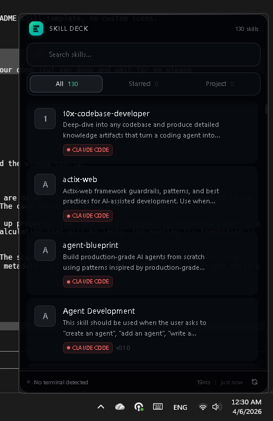

<div align="center">



<h3>Universal coding agent skill browser</h3>

<p>Desktop overlay for browsing, searching, and copying skill references across Claude Code, Cursor, Copilot, Codex, and many AI coding agents.</p>


</div>

---

## What It Does

Press `Ctrl+Shift+K`, a browser overlay slides in. Search, filter, and browse agent artifacts in one place. Open an item to inspect content, copy its reference, and manage update metadata.

The Finder panel is on demand, open it only when needed via `Ctrl+F`, `/`, or the `Find` button. Finder open state is persisted per user.

No switching between editors. No hunting through dotfiles. One overlay, everything visible.

## Supported Agents

Skill Deck supports 15+ coding agents through a single registry and parser pipeline.

Examples include Claude Code, Codex, Cursor, GitHub Copilot, Windsurf, Gemini CLI, Cline, Roo Code, Continue, Aider, Amazon Q, JetBrains AI, Tabnine, Augment, and universal `AGENTS.md` conventions.

Artifact support includes skills, slash commands, and hooks (Claude settings hooks), plus rules, prompts, workflows, and config files where present.

## Features

- **Universal scan** — discovers agent artifacts from all 15+ agents in one pass
- **Live search** — instant filter across skill names and descriptions
- **Type filters** — filter by artifact type, skill, command, hook, rule, workflow, prompt, or config
- **Intent filters** — use-case and tag facets to answer when to use a skill
- **On-demand Finder** — search and intent filters stay available, shown only when requested
- **Finder persistence** — remembers whether Finder was open or collapsed
- **Starred skills** — pin your most-used skills to a dedicated tab
- **Command and hook copy flow** — copy slash commands and hook commands directly when available
- **Update checker** — detects newer versions of skills from their GitHub repos
- **Repo detection** — automatically finds the GitHub source and `npx skills add` command for each skill
- **Card View** — parent/child skill hierarchies rendered as collapsible cards
- **Agent groups** — skills organized by agent with brand colors
- **Theme system** — System, Dark, and Light modes
- **Overlay behavior modes** — switch between pinned and auto-hide in tray menu or in-app settings
- **Global hotkey** — `Ctrl+Shift+K` default, configurable to any valid 2-key or 3-key combo
- **Avatar icon customization** — click the skill icon to assign an emoji quickly

## Platform Support

Current status for v0.1:

| Capability | Windows | macOS | Linux |
|---|---|---|---|
| Overlay, scan, search, starred, grouped/Card View, update checks | Yes | Yes | Yes |

## Install & Run

**Prerequisites:** [Rust](https://rustup.rs), [Node.js 22+](https://nodejs.org), [pnpm 10+](https://pnpm.io)

```bash
git clone https://github.com/OthmanAdi/skill-deck
cd skill-deck
pnpm install
pnpm tauri dev
```

**Production build:**

```bash
pnpm tauri build
```

Binary output: `src-tauri/target/release/`

## Releases

Prebuilt binaries and installers are published on GitHub Releases.

- Windows x64: NSIS installer, MSI installer, executable
- macOS ARM64 and x64: platform bundles generated by Tauri action
- Linux x64: platform bundles generated by Tauri action

Latest release page: `https://github.com/OthmanAdi/skill-deck/releases/latest`

**Run tests:**

```bash
cd src-tauri && cargo test
pnpm check
```

## Architecture

Adapter pattern — adding a new agent is one struct in one file.

```
src-tauri/src/
├── agents/
│   ├── registry.rs       # All 15+ agents: paths, format, brand color
│   └── scanner.rs        # Filesystem glob → parse → Vec<Skill>
├── parsers/
│   ├── frontmatter.rs    # Universal YAML+MD parser (covers 90% of formats)
│   ├── skill_md.rs       # SKILL.md format (Claude Code, Codex)
│   └── claude_hooks.rs   # Claude settings hook extraction
├── models/
│   ├── skill.rs          # Universal Skill struct — all adapters normalize here
│   ├── agent.rs          # AgentInfo: paths, format, brand color per agent
│   └── config.rs         # User preferences: hotkey, starred skills, theme
├── commands/             # Tauri IPC commands
│   ├── skills.rs         # scan_skills, list_agents, read_skill_content
│   ├── preferences.rs    # toggle_star, set_hotkey, get_config
│   └── updates.rs        # check_skill_update, set_skill_repo
└── detection/
    ├── repo_detector.rs  # GitHub URL + npx install command extraction
    ├── update_checker.rs # GitHub API version comparison
    └── skill_history.rs  # Local snapshots for restore workflow

src/
└── lib/
    ├── components/       # Svelte 5 overlay UI components
    ├── stores/           # Runes-based state ($state, $derived)
    └── types/            # TypeScript interfaces matching Rust models
```

### Skill Discovery

Skill Deck enriches parsed artifacts with normalized discovery tags and use-case labels.

- Frontmatter tags and categories are used when available
- A deterministic heuristic fallback classifies skills by intent
- Faceted filters in the overlay help users decide which skill to run

Detailed design notes: `docs/skill-discovery.md`

**Key rule:** The frontend never sees agent-specific types. Everything normalizes to `models/skill.rs`. Adding a new agent means editing only `registry.rs`.

## Tech Stack

| Layer | Technology |
|-------|-----------|
| Desktop shell | [Tauri v2](https://tauri.app) |
| Backend | Rust 1.90, tokio, serde, gray_matter, reqwest |
| Frontend | Svelte 5 (runes), SvelteKit 2, Tailwind CSS v4, TypeScript |


## Adding a New Agent

1. Add a variant to `AgentId` enum in `src-tauri/src/models/skill.rs`
2. Add one entry to `src-tauri/src/agents/registry.rs` with: `display_name`, `paths` (using `$HOME`/`$PROJECT`), `format`, `brand_color`
3. If the format is novel, add a parser in `src-tauri/src/parsers/`. Otherwise `frontmatter.rs` handles it.

The scanner picks it up automatically. No other changes needed.

## Project Setup for AI Agents

This repo is instrumented for multi-agent development:

| File | Agent |
|------|-------|
| `CLAUDE.md` | Claude Code |
| `AGENTS.md` | Codex, Copilot, all universal |
| `GEMINI.md` | Gemini CLI |
| `.cursorrules` | Cursor |
| `.windsurfrules` | Windsurf |
| `.github/copilot-instructions.md` | GitHub Copilot |

## Contributing

Please read `CONTRIBUTING.md` and `SECURITY.md` before opening pull requests.

1. Fork the repo
2. Add a new agent — edit only `registry.rs` (see [Adding a New Agent](#adding-a-new-agent))
3. Or fix a bug, add a theme, improve a parser
4. Run `cargo test && cargo clippy -- -D warnings && pnpm check` before submitting
5. Open a PR

## License

MIT — [Ahmad Adi](https://github.com/OthmanAdi)
