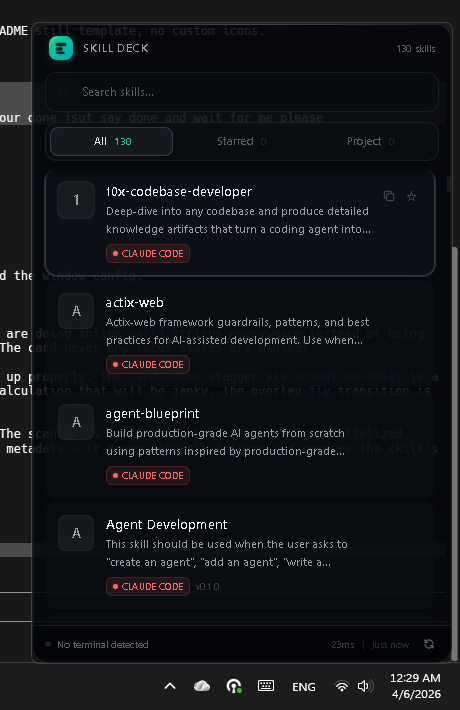

<div align="center">


<h3>Universal coding agent skill browser</h3>

<p>Desktop overlay for browsing, searching, and injecting skills across Claude Code, Cursor, Copilot, Codex, and 15+ AI coding agents.</p>


</div>

---

## What It Does

Press `Ctrl+Shift+K`, a skill browser slides in. Search, filter, and browse every skill installed across all your coding agents in one place. Drag a skill card onto a terminal window and the install command injects directly. Close it with `Escape`.

No switching between editors. No hunting through dotfiles. One overlay, everything visible.

## UI Preview

<p align="center">
  
</p>


## Supported Agents

| Agent | Skills Found At |
|-------|----------------|
| **Claude Code** | `~/.agents/skills/`, `~/.claude/skills/`, project `.claude/` |
| **Codex** | `~/.codex/skills/`, project `AGENTS.md` |
| **Cursor** | `~/.cursor/rules/`, project `.cursor/rules/` |
| **GitHub Copilot** | `~/.github/`, project `.github/copilot/` |
| **Windsurf** | `~/.codeium/windsurf/memories/`, project `.windsurfrules` |
| **Gemini CLI** | `~/.gemini/`, project `GEMINI.md` |
| **Cline** | `~/.cline/`, project `.clinerules` |
| **Roo Code** | `~/.roo/`, project `.roo/` |
| **Continue** | `~/.continue/config/prompts/` |
| **Aider** | `~/.aider/`, project `.aider.conf.yml` |
| **Amazon Q** | `~/.aws/amazonq/prompts/` |
| **JetBrains AI** | `~/.config/JetBrains/prompts/` |
| **Tabnine** | `~/.tabnine/` |
| **Augment Code** | project `.augment/` |
| **AGENTS.md** | project `AGENTS.md` |

## Features

- **Universal scan** — discovers skills from all 15+ agents in one pass
- **Live search** — instant filter across skill names and descriptions
- **Starred skills** — pin your most-used skills to a dedicated tab
- **Project context** — detects your focused terminal's CWD and surfaces project-specific skills automatically
- **Drag to inject** — drag a skill card onto any terminal window to inject the install command via clipboard
- **Update checker** — detects newer versions of skills from their GitHub repos
- **Repo detection** — automatically finds the GitHub source and `npx skills add` command for each skill
- **Tree view** — parent/child skill hierarchies rendered as collapsible groups
- **Agent groups** — skills organized by agent with brand colors
- **Theme system** — System, Dark, and Light modes
- **Overlay behavior modes** — switch between pinned and auto-hide in tray menu or in-app settings
- **Global hotkey** — `Ctrl+Shift+K` default, configurable to any valid 2-key or 3-key combo
- **Avatar icon customization** — click the skill icon to assign an emoji quickly

## Platform Support

Current status for v0.1:

| Capability | Windows | macOS | Linux |
|---|---|---|---|
| Overlay, scan, search, starred, tree view | Yes | Yes | Yes |
| Terminal context detection | Yes | Not yet | Not yet |
| Drag to terminal injection | Yes | Not yet | Not yet |

Until parity lands, terminal context and terminal injection should be considered Windows-first capabilities.

## Install & Run

**Prerequisites:** [Rust](https://rustup.rs), [Node.js 22+](https://nodejs.org), [pnpm 10+](https://pnpm.io)

```bash
git clone https://github.com/OthmanAdi/skill-deck
cd skill-deck
pnpm install
pnpm tauri dev
```

**Production build:**

```bash
pnpm tauri build
```

Binary output: `src-tauri/target/release/`

## Releases

Prebuilt binaries and installers are published on GitHub Releases.

- Windows x64: NSIS installer, MSI installer, executable
- macOS ARM64 and x64: platform bundles generated by Tauri action
- Linux x64: platform bundles generated by Tauri action

Latest release page: `https://github.com/OthmanAdi/skill-deck/releases/latest`

**Run tests:**

```bash
cd src-tauri && cargo test
pnpm check
```

## Architecture

Adapter pattern — adding a new agent is one struct in one file.

```
src-tauri/src/
├── agents/
│   ├── registry.rs       # All 15+ agents: paths, format, brand color
│   └── scanner.rs        # Filesystem glob → parse → Vec<Skill>
├── parsers/
│   ├── frontmatter.rs    # Universal YAML+MD parser (covers 90% of formats)
│   └── skill_md.rs       # SKILL.md format (Claude Code, Codex)
├── models/
│   ├── skill.rs          # Universal Skill struct — all adapters normalize here
│   ├── agent.rs          # AgentInfo: paths, format, brand color per agent
│   └── config.rs         # User preferences: hotkey, starred skills, theme
├── commands/             # Tauri IPC commands
│   ├── skills.rs         # scan_skills, list_agents, read_skill_content
│   ├── context.rs        # detect_terminal_context (CWD of focused terminal)
│   ├── preferences.rs    # toggle_star, set_hotkey, get_config
│   ├── injection.rs      # inject_to_terminal, get_window_at_point
│   └── updates.rs        # check_skill_updates, set_skill_repo
└── detection/
    ├── repo_detector.rs  # GitHub URL + npx install command extraction
    ├── update_checker.rs # GitHub API version comparison
    ├── window_at_point.rs # OS-native window detection
    └── terminal_inject.rs # Clipboard + keystroke injection

src/
└── lib/
    ├── components/       # Svelte 5 overlay UI components
    ├── stores/           # Runes-based state ($state, $derived)
    └── types/            # TypeScript interfaces matching Rust models
```

**Key rule:** The frontend never sees agent-specific types. Everything normalizes to `models/skill.rs`. Adding a new agent means editing only `registry.rs`.

## Tech Stack

| Layer | Technology |
|-------|-----------|
| Desktop shell | [Tauri v2](https://tauri.app) |
| Backend | Rust 1.90, tokio, serde, gray_matter, reqwest |
| Frontend | Svelte 5 (runes), SvelteKit 2, Tailwind CSS v4, TypeScript |
| OS APIs (Windows) | `windows` crate — Win32 window/process/clipboard APIs |
| OS APIs (Linux) | x11rb, procfs |
| OS APIs (macOS) | cocoa, objc |

## Adding a New Agent

1. Add a variant to `AgentId` enum in `src-tauri/src/models/skill.rs`
2. Add one entry to `src-tauri/src/agents/registry.rs` with: `display_name`, `paths` (using `$HOME`/`$PROJECT`), `format`, `brand_color`
3. If the format is novel, add a parser in `src-tauri/src/parsers/`. Otherwise `frontmatter.rs` handles it.

The scanner picks it up automatically. No other changes needed.

## Project Setup for AI Agents

This repo is instrumented for multi-agent development:

| File | Agent |
|------|-------|
| `CLAUDE.md` | Claude Code |
| `AGENTS.md` | Codex, Copilot, all universal |
| `GEMINI.md` | Gemini CLI |
| `.cursorrules` | Cursor |
| `.windsurfrules` | Windsurf |
| `.github/copilot-instructions.md` | GitHub Copilot |

## Contributing

Please read `CONTRIBUTING.md` and `SECURITY.md` before opening pull requests.

1. Fork the repo
2. Add a new agent — edit only `registry.rs` (see [Adding a New Agent](#adding-a-new-agent))
3. Or fix a bug, add a theme, improve a parser
4. Run `cargo test && cargo clippy -- -D warnings && pnpm check` before submitting
5. Open a PR

## License

MIT — [Ahmad Adi](https://github.com/OthmanAdi)
